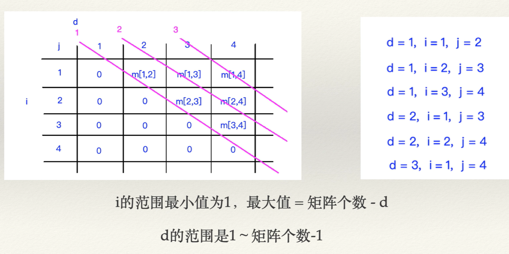

## 第14章 算法设计与技巧

### 14.2 动态规划

#### 什么是动态规划

通过把复杂的的原问题分解为相对简单的子问题的方法

#### 动态规划有哪些特征

- 重叠子问题

  子问题重复出现

- 最优子结构

  一个问题的最优解包含其子问题的最优解（也就是说子问题的最优解也就是原问题的最优解）

- 无后效性

  某阶段的状态一旦确定，则此后过程中的演变不再受此前各种状态及决策的影响

#### 动态规划问题的解决步骤

- 确定子问题
- 确定状态转移方程
- 确定边界条件

#### 题目：

求矩阵p=[5, 10, 3, 12, 5]的最少乘法运算次数 ?

#### 分析：

上面的数组可以换成下面的矩阵


因此原问题求矩阵的问题可以转换为下面的子问题


根据上面的表格（其实是二维数组）可以得到下面的


有上面的结论可以得出上面的公式


再次分析表格，可以得出下面的公式


根据下面的表格可以得出斜边和纵轴的范围



#### 代码：

根据上面的分析可以写出下面的代码：

```js
const matrixChainOrder = p => {
    // 获取数组的长度
    const n = p.length
    // 定义一个数组保存项链两个矩阵的乘值
    const m = []
    // 初始化数组
    for(let i = 0; i <= n; n++) {
        m[i] = 0
        m[i][i] = 0
    }
    // 遍历斜线d
    for(let l = 2; l < n; l++) {
        // 遍历横轴
        for(let i = 0; i <= (n - l) + 1; i++) {
            // 计算纵轴
            const j = (i + l) - 1
            // 通过横纵轴遍历矩阵的分割
            for(let k = i; k <= j - 1; k++) {
                // 计算当前矩阵乘值
                const q = m[i][k - 1] + m[k][j] + (p[i - 1] * p[k] * p[j])
                // 判断当前计算出来的之是否比之前的大
                if(q < m[i][j]) {
                    // 如果比之前的大则将之前的之复制给当前的矩阵乘积
                    m[i][j] = q
                }
            }
        }
    }
    return m[1][n - 1]
}
```

